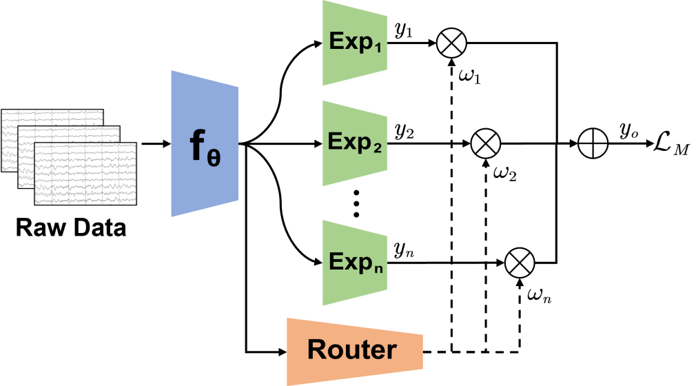

# Seizure-MoE & Mix-Moe
El código oficial del artículo [Mixture of Experts for EEG-Based Seizure Subtype Classification](https://ieeexplore.ieee.org/document/10335740) (IEEE TNSRE).

<p align="center">
 
</p>

# Resumen
La epilepsia es un trastorno neurológico generalizado que afecta a aproximadamente 50 millones de personas en todo el mundo. La clasificación de subtipos de crisis basada en electroencefalograma (EEG) desempeña un papel crucial en el diagnóstico y tratamiento de la epilepsia. Sin embargo, la clasificación automática de subtipos de crisis enfrenta al menos dos desafíos: 1) desequilibrio de clases, es decir, ciertos tipos de crisis son considerablemente menos comunes que otros; y, 2) falta de integración de conocimiento previo, lo que hace que se necesite una gran cantidad de muestras de EEG etiquetadas para entrenar un modelo de aprendizaje automático, en particular, de aprendizaje profundo. Este artículo propone dos modelos novedosos de Mezcla de Expertos (MoE), Seizure-MoE y Mix-MoE, para la clasificación de subtipos de crisis basada en EEG. En particular, Mix-MoE aborda adecuadamente los dos desafíos anteriores: 1) introduce un nuevo muestreador de desequilibrio para tratar el desequilibrio de clases significativo; y, 2) incorpora conocimiento previo de características de EEG extraídas manualmente en la red neuronal profunda para mejorar el rendimiento de la clasificación. Los experimentos en dos conjuntos de datos públicos demostraron que los modelos propuestos SeizureMoE y Mix-MoE superaron a múltiples enfoques existentes en la clasificación de subtipos de crisis basada en EEG entre sujetos. Los modelos MoE propuestos también pueden extenderse fácilmente a otros problemas de clasificación de EEG con desequilibrio de clases severo, por ejemplo, la clasificación de etapas del sueño.

# Uso
```
model.py: EEGNet as feature extractor.
MoE.py: Seizure_MoE (set 'tra_expert' as 'None') and Mix_MoE.
requirements.txt: Some required packages.
```

# Cita
```
@ARTICLE{10335740,
  author={Du, Zhenbang and Peng, Ruimin and Liu, Wenzhong and Li, Wei and Wu, Dongrui},
  journal={IEEE Transactions on Neural Systems and Rehabilitation Engineering}, 
  title={Mixture of Experts for EEG-Based Seizure Subtype Classification}, 
  year={2023},
  volume={31},
  number={},
  pages={4781-4789},
  doi={10.1109/TNSRE.2023.3337802}}
```

# Agradecimientos
El código se basa en el proyecto [Mixture of Experts](https://github.com/davidmrau/mixture-of-experts).
