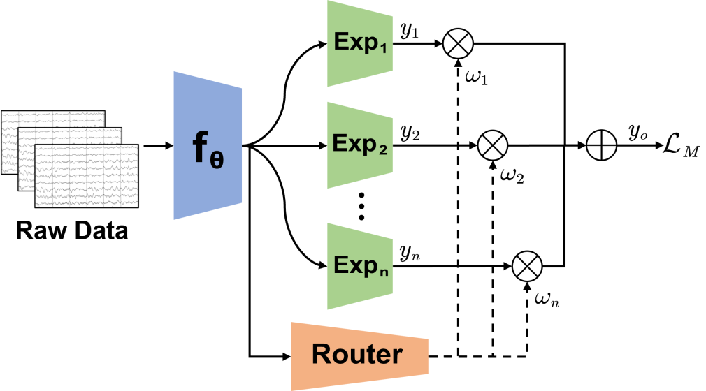

# Seizure-MoE & Mix-Moe
The official code for the paper [Mixture of Experts for EEG-Based Seizure Subtype Classification](https://ieeexplore.ieee.org/document/10335740) (IEEE TNSRE).

<p align="center">
 
</p>

# Abstract
Epilepsy is a pervasive neurological disorder affecting approximately 50 million individuals worldwide. Electroencephalogram (EEG) based seizure subtype classification plays a crucial role in epilepsy diagnosis and treatment. However, automatic seizure subtype classification faces at least two challenges: 1) class imbalance, i.e., certain seizure types are considerably less common than others; and, 2) no a priori knowledge integration, so that a large number of labeled EEG samples are needed to train a machine learning model, particularly, deep learning. This paper proposes two novel Mixture of Experts (MoE) models, Seizure-MoE and Mix-MoE, for EEG-based seizure subtype classification. Particularly, Mix-MoE adequately addresses the above two challenges: 1) It introduces a novel imbalanced sampler to address significant class imbalance; and, 2) It incorporates a priori knowledge of manual EEG features into the deep neural network to improve the classification performance. Experiments on two public datasets demonstrated that the proposed SeizureMoE and Mix-MoE outperformed multiple existing approaches in cross-subject EEG-based seizure subtype classification. Our proposed MoE models may also be easily extended to other EEG classification problems with severe class imbalance, e.g., sleep stage classification.

# Usage
```
model.py: EEGNet as feature extractor.
MoE.py: Seizure_MoE (set 'tra_expert' as 'None') and Mix_MoE.
requirements.txt: Some required packages.
```

# Citation
```
@ARTICLE{10335740,
  author={Du, Zhenbang and Peng, Ruimin and Liu, Wenzhong and Li, Wei and Wu, Dongrui},
  journal={IEEE Transactions on Neural Systems and Rehabilitation Engineering}, 
  title={Mixture of Experts for EEG-Based Seizure Subtype Classification}, 
  year={2023},
  volume={31},
  number={},
  pages={4781-4789},
  doi={10.1109/TNSRE.2023.3337802}}
```

# Acknowledgement
The code is based on the [Mixture of Experts](https://github.com/davidmrau/mixture-of-experts).
